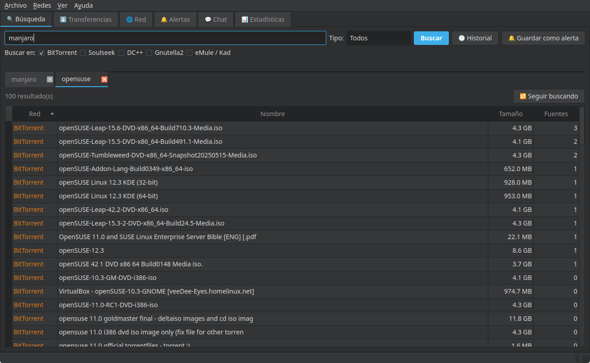
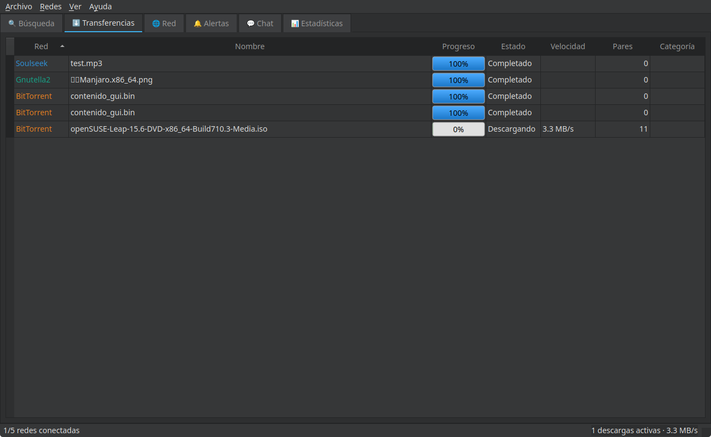
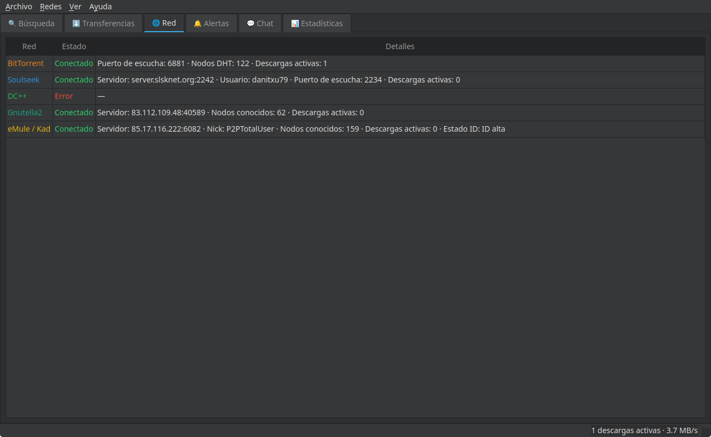

<p align="center">
  
</p>

<h3 align="center">Un único cliente. Cinco redes P2P reales. Cero dependencias externas.</h3>

<p align="center">
  BitTorrent · Soulseek · DC++/NMDC · Gnutella2 · eMule/Kad
</p>

<p align="center">
  <a href="#capturas">Capturas</a> ·
  <a href="#funciones">Funciones</a> ·
  <a href="#redes-soportadas">Redes soportadas</a> ·
  <a href="#instalación">Instalación</a> ·
  <a href="#configuración-y-seguridad">Seguridad</a> ·
  <a href="#arquitectura-y-principios-de-diseño">Arquitectura</a> ·
  <a href="#estado-del-proyecto-y-hoja-de-ruta">Estado y hoja de ruta</a>
</p>

---

## Qué es P2P Total

**P2P Total** es un cliente P2P de escritorio para Linux, Windows y
macOS que reúne, en
una sola aplicación con una sola interfaz, cinco redes de intercambio
de ficheros que normalmente exigirían cinco programas distintos:
**BitTorrent, Soulseek, DC++ (NMDC), Gnutella2 y eMule/Kad (eD2k +
Kademlia)**.

No es un panel que lance procesos de aMule, qBittorrent o Nicotine+
por debajo: **cada protocolo está reimplementado desde cero**, sobre
sockets y `asyncio` puros de Python, dentro del mismo proceso que la
interfaz gráfica. Cero binarios externos, cero dependencia de otros
clientes instalados en el sistema — solo el propio programa hablando
el protocolo de cada red directamente con sus servidores/hubs/nodos.

Todas y cada una de las piezas descritas en este documento se han
**validado contra infraestructura real**: servidores públicos de
Soulseek y eD2k, hubs DC++ y hubs/GWebCache de Gnutella2 reales, y
transferencias BitTorrent reales vía DHT — no solo contra simuladores
locales. El historial técnico completo, con cada bug real encontrado y
cómo se comprobó cada función, vive en [`DEVLOG.md`](DEVLOG.md).

## Capturas

<p align="center"><b>Búsqueda simultánea en varias redes, con resultados reales</b></p>
<p align="center"></p>

<p align="center"><b>Cola de transferencias: pares conectados y velocidad en vivo</b></p>
<p align="center"></p>

<p align="center"><b>Estado de conexión en vivo de las cinco redes a la vez</b></p>
<p align="center"></p>

## Redes soportadas

| Red | Protocolo | Búsqueda | Descarga | Compartir/subir | Chat |
|---|---|:---:|:---:|:---:|:---:|
| **BitTorrent** | libtorrent + DHT | ✅ (DHT y web, apibay.org) | ✅ | ✅ (seed nativo) | — |
| **Soulseek** | Nativo (estudiado de Nicotine+) | ✅ | ✅ | ✅ | ✅ salas y privado |
| **DC++ / NMDC** | Nativo | ✅ | ✅ | ✅ | ✅ chat de hub |
| **Gnutella2** | Nativo (árbol G2, no G1) | ✅ | ✅ | ✅ | — |
| **eMule / Kad** | Nativo (eD2k + Kademlia) | ✅ | ✅ | ✅ | — (amigos/créditos) |

Todas las conexiones salientes de las cinco redes pueden enrutarse a
través de un proxy SOCKS5 o HTTP, y todas soportan límites de
velocidad globales y por descarga.

## Funciones

### Búsqueda y descubrimiento
- Búsqueda simultánea en las cinco redes desde una sola caja de texto,
  con resultados que llegan **en streaming** según van apareciendo
  (no hay que esperar a que termine toda la red más lenta).
- Deduplicación de resultados equivalentes entre fuentes distintas,
  sumando el número de fuentes disponibles por resultado.
- Búsqueda directa de torrents por nombre (vía apibay.org) además de
  la resolución clásica por magnet/infohash.
- Historial de búsquedas persistente entre sesiones, y **alertas**:
  guarda una búsqueda para que se repita sola en segundo plano y avise
  cuando aparezca contenido nuevo.
- **Browse Host** en Gnutella2 y **Browse User** en Soulseek: explora
  el catálogo entero compartido por un nodo o usuario concreto, no
  solo un resultado suelto.
- Lista pública de hubs DC++ integrada (agregador tipo hublist), para
  elegir hub sin teclear IP:puerto a mano.
- Abrir directamente un enlace `magnet:`, `ed2k://` o `dchub://`
  pegado o copiado al portapapeles, o arrastrar un `.torrent` sobre la
  ventana.
- Carpeta vigilada: cualquier `.torrent` que aparezca en una carpeta
  configurada se añade solo, sin abrirlo a mano.
- Filtro de resultados por tipo de archivo y por rango de tamaño
  (mínimo/máximo), para descartar archivos falsos o mal nombrados sin
  tener que revisarlos uno a uno.

### Transferencias
- Cola de descargas con prioridad reordenable (arrastrar filas o
  subir/bajar), categorías con carpeta de destino propia (al estilo
  aMule/qBittorrent), y reintento automático configurable cuando una
  descarga se queda sin fuentes.
- Selección de archivos y descarga secuencial dentro de un torrent
  multi-archivo: al añadir uno con más de un archivo se abre siempre
  una ventana para elegir cuáles descargar, la elección se recuerda
  entre sesiones, y desmarcar un archivo y aceptar borra del disco lo
  que ya se hubiera descargado de él.
- Límites de velocidad de subida/bajada, globales y por descarga, con
  un planificador opcional que aplica unos límites alternativos solo
  durante una franja horaria del día (p.ej. limitar más de noche).
- **Pausar y reanudar de verdad**: retoma desde los bytes ya escritos
  en disco, no reinicia desde cero, en las cinco redes.
- Límite de ratio y/o tiempo de siembra en BitTorrent (Preferencias →
  BitTorrent): al superar el que se haya configurado, el torrent se
  pausa solo, sin dejar de sembrar indefinidamente.
- **Las descargas activas sobreviven a cerrar y reabrir la
  aplicación**: al reconectar cada red, se reconstruye automáticamente
  el estado necesario para retomar cualquier descarga que seguía en
  curso.
- Verificación de integridad de archivos ya descargados (a demanda o
  automática al completar), con reverificación de hash nativa por red
  (TTH en DC++, SHA1 en Gnutella2, MD4/AICH por bloque en eD2k, hash de
  pieza en BitTorrent).
- Barra de progreso coloreada según el estado (descargando, pausado,
  completado, error), al estilo aMule.

### Compartir y subir
- **Las cinco redes sirven contenido a otros peers**, no solo
  descargan: BitTorrent siembra de fábrica vía libtorrent, y Soulseek,
  DC++, Gnutella2 y eMule/eD2k tienen implementado desde cero el lado
  servidor de su protocolo (responder búsquedas, atender peticiones de
  descarga, gestionar subidas firewalled/LowID vía *push*/*callback*).
- Crear un `.torrent` nuevo desde un archivo o carpeta propios (menú
  Archivo → "Crear torrent…"), con trackers, comentario y opción de
  torrent privado, empezando a sembrarlo de inmediato.
- Indexado de carpetas compartidas con cálculo de hash por red (SHA1,
  MD4+AICH) en una sola pasada.
- Cola de subida con slots limitados, lista de amigos y sistema de
  créditos en eD2k/Kad (prioriza a quien más te ha compartido, igual
  que el eMule real).

### Chat y funciones sociales
- Soulseek: salas públicas y mensajes privados, con lista de usuarios
  presentes en cada sala.
- DC++: chat del hub (canal compartido por todos los conectados) y
  mensajes privados.
- Aviso nativo del sistema al recibir un mensaje privado con la
  ventana minimizada u oculta en la bandeja, configurable en
  Preferencias.

### Conectividad y privacidad
- Proxy SOCKS5 y HTTP para las conexiones salientes de las cinco redes
  (handshake propio, sin librerías de terceros).
- Soporte de IPv6 donde el protocolo real de cada red lo permite
  (BitTorrent y DC++ completo; en Soulseek/G2/eD2k, la conexión TCP ya
  funciona con IPv6, documentado el límite real de protocolo en los
  campos de direccionamiento binarios de esas tres redes).
- Ofuscación de protocolo (RC4) en eD2k para esquivar el *throttling*
  de tráfico P2P de algunos proveedores de internet, configurable en
  los tres modos del eMule real.
- Filtro de IPs estilo aMule/eMule (Preferencias → Filtro de IPs):
  carga un `ipfilter.dat` en el formato clásico Bluetack y bloquea
  conexiones -salientes y entrantes- hacia/desde cualquier IP de un
  rango marcado como peligroso, aplicado a las cinco redes.
- **Contraseñas guardadas en el almacén de credenciales nativo del
  sistema operativo** (Secret Service/GNOME Keyring/KWallet en Linux,
  Keychain en macOS, Credential Manager en Windows) en vez de en texto
  plano — salvo en modo portable, donde se quedan autocontenidas en
  `config.json` a propósito, para no dejar rastro alguno en el equipo.

### Interfaz y experiencia de uso
- GUI en PyQt6 con estética inspirada en aMule/Shareaza, tema claro y
  oscuro, e interfaz en **trece idiomas** (español, inglés, euskera,
  francés, italiano, portugués, alemán, catalán, gallego, ruso, chino,
  japonés y coreano).
- Pestañas de Búsqueda (con sub-pestañas independientes por búsqueda),
  Transferencias, Red (detalle de conexión en vivo por red), Chat,
  Alertas y Estadísticas.
- La pestaña Estadísticas incluye una gráfica de velocidad en tiempo
  real (bajada/subida agregadas de las cinco redes, últimos 5 minutos),
  dibujada con `QPainter` puro al estilo de qBittorrent/Transmission,
  además de los totales acumulados y el histórico diario ya existentes.
- Lista de servidores/hubs conocidos (DC++, Gnutella2 y eMule) con
  usuarios y ficheros compartidos cuando el protocolo los expone,
  filtro de texto, y clic derecho para conectar directamente sin
  pasar por Preferencias.
- Icono en la bandeja del sistema, con menú rápido (conectar/
  desconectar todas las redes, pausar/reanudar todas las descargas) y
  opción de minimizar a bandeja al cerrar o al minimizar.
- **Control remoto / API web opcional**: gestiona las descargas
  (listar, pausar, reanudar, cancelar, borrar, buscar y añadir nuevas)
  desde el navegador de cualquier dispositivo de la red, sin abrir la
  ventana de escritorio — pensado para usarlo con la aplicación
  minimizada a la bandeja. Desactivado por defecto y protegido con un
  token de acceso propio.
- Conexión automática al arrancar, configurable por red de forma
  independiente desde su pestaña en Preferencias.
- Notificaciones nativas del sistema operativo al completar o fallar
  una descarga.
- Pestaña de estadísticas globales: total subido/bajado, ratio y
  tiempo conectado por red, con histórico diario.
- Importar/exportar `config.json` desde la propia GUI, y **modo
  portable** (todo junto al ejecutable, sin tocar `~/.config`), pensado
  para llevar el programa entero en un pendrive.
- Aviso de nueva versión disponible al arrancar (comprobado contra los
  releases publicados en GitHub), con acceso directo a la descarga, y
  botón "Buscar actualizaciones" en el menú Ayuda para comprobarlo
  también a mano en cualquier momento.
- Accesibilidad: nombres accesibles para lectores de pantalla en
  tablas y campos, menú contextual navegable con Mayús+F10 igual que
  con el botón derecho del ratón, y atajo Supr para borrar descargas
  seleccionadas.

## Instalación

### Paquete precompilado (recomendado)

Cada [release de GitHub](https://github.com/AnabasaSoft/P2P-Total/releases/latest)
incluye un instalador para cada sistema — no hace falta tener Python
instalado, cada paquete lleva ya todo lo necesario:

**Linux**

```bash
# Debian / Ubuntu y derivadas
sudo dpkg -i p2p-total_*.deb

# Fedora / openSUSE / RHEL y derivadas
sudo rpm -i p2p-total-*.rpm

# AppImage — cualquier distro, sin instalar nada en el sistema
chmod +x P2P-Total-*.AppImage
./P2P-Total-*.AppImage

# Flatpak — bundle autónomo, sin publicar en Flathub
flatpak install P2P-Total-*.flatpak
```

**Windows**

Descarga `P2P-Total-Setup-*.exe` y ejecútalo: es el instalador clásico
"Siguiente, Siguiente, Instalar" (Inno Setup). Al no llevar firma
digital de código, Windows SmartScreen puede avisar de "editor no
reconocido" la primera vez — es esperable en una primera versión sin
firmar; en "Más información" → "Ejecutar de todas formas" continúa la
instalación con normalidad.

**macOS**

Descarga `P2P-Total-*.dmg`, ábrelo y arrastra `P2P Total.app` a la
carpeta Aplicaciones. Al no estar firmada ni notarizada por Apple,
Gatekeeper bloqueará la primera apertura — clic derecho sobre la
app → "Abrir" para confirmar la excepción una única vez.

### Desde el código fuente (desarrollo)

Requisitos: Python 3.11+ y las dependencias de `requirements.txt`
(PyQt6, qasync, keyring, libtorrent; el resto de redes no necesitan
ninguna librería externa, están implementadas sobre `asyncio` puro).

```bash
git clone https://github.com/AnabasaSoft/P2P-Total.git
cd P2P-Total
python -m venv venv && source venv/bin/activate
pip install -r requirements.txt

python main.py gui          # interfaz gráfica
python main.py config        # configuración interactiva por terminal
python main.py download ...  # descarga por línea de comandos
```

## Configuración y seguridad

La configuración vive en `~/.config/p2p-total/config.json` (o junto al
ejecutable, en modo portable), con permisos `600`. Las contraseñas
(Soulseek, hub de DC++, proxy) **no se guardan en texto plano**: se
delegan en el almacén de credenciales nativo del sistema operativo a
través de `keyring`, y solo un identificador de referencia queda en el
fichero de configuración. La excepción intencional es el modo
portable, donde todo — incluidas las contraseñas — se queda
autocontenido en el propio `config.json`, para poder llevar el
programa (y su configuración) en un pendrive sin dejar ni rastro ni
dependencias en el equipo donde se ejecute.

## Arquitectura y principios de diseño

```
core/       Lógica común: modelos, gestor de descargas, base de datos
            SQLite, configuración+keyring, límites de velocidad,
            proxy SOCKS5/HTTP, indexado de carpetas compartidas...
backends/   Una implementación por red (torrent, soulseek, dcpp, g2,
            emule), todas detrás de la misma interfaz NetworkBackend.
gui/        Interfaz PyQt6, integrada con los backends async vía
            qasync (sin hilos).
```

Principio de diseño central: **ni la GUI ni el `DownloadManager`
hablan nunca directamente con libtorrent, Soulseek, DC++, G2 o eMule**
— solo con la interfaz común `NetworkBackend`. Añadir o modificar una
red no toca la GUI, y viceversa.

Restricción de diseño innegociable: **todo corre dentro del propio
proceso Python**, vía sockets y `asyncio` crudos. Cero dependencia de
aMule ni de ningún otro cliente externo, y cero invocación de binarios
externos por shell. `libtorrent` es la única librería usada como tal
(no como proceso externo) porque reimplementar BitTorrent+DHT desde
cero no aporta nada frente a una librería madura y libre; las otras
cuatro redes no tenían una librería Python madura y fiable disponible,
así que están reimplementadas desde cero estudiando el protocolo real.

## Estado del proyecto y hoja de ruta

([listado completo de releases](https://github.com/AnabasaSoft/P2P-Total/releases)).

Las **cinco redes** (BitTorrent, Soulseek, DC++, Gnutella2, eMule/Kad)
y la **GUI completa** están implementadas y validadas contra
infraestructura real, incluyendo búsqueda, descarga, subida/compartir,
pausar/reanudar con persistencia entre reinicios de la aplicación,
chat, verificación de integridad, proxy, IPv6 donde el protocolo lo
permite, y todas las funciones de la sección [Funciones](#funciones)
anteriores.

La pestaña **Red** de la GUI tiene ahora una subpestaña por red, con
un dato por línea al estilo de los paneles de aMule (no una cadena de
texto amontonada), mostrando toda la información que su protocolo
permite ofrecer: IP externa propia en Soulseek, nombre y usuarios del
hub en DC++, usuarios/archivos anunciados por el servidor y estado de
Kademlia en eMule, y estado de cada tracker (URL, si funciona,
semillas y pares) por torrent, tamaño estimado de toda la red DHT y
totales de bytes de la sesión en BitTorrent.

Esa misma pestaña **Red** incluye ahora, en DC++, Gnutella2 y eMule,
un botón "Servidores conocidos…" que abre una lista filtrable de
servidores/hubs (con usuarios y ficheros compartidos cuando el
protocolo real los expone) con clic derecho para conectar directamente
al elegido, sin pasar por Preferencias — Soulseek (un único servidor
central) y BitTorrent (sin concepto de "servidor", solo trackers por
torrent) quedan fuera por no aplicar.

Con el backlog original (36 puntos) completado, se ha cerrado también
una **segunda ronda de mejoras** (puntos 37 a 42): crear un `.torrent`
nuevo desde contenido propio, el límite de ratio/tiempo de siembra en
BitTorrent (ver más arriba, en
[Compartir y subir](#compartir-y-subir)), el filtro de IPs estilo
aMule/eMule (ver [Conectividad y privacidad](#conectividad-y-privacidad)),
el filtro de resultados de búsqueda por tamaño (ver
[Búsqueda y descubrimiento](#búsqueda-y-descubrimiento)), la
notificación nativa de mensajes de chat (ver
[Chat y funciones sociales](#chat-y-funciones-sociales)) y la gráfica
de velocidad en tiempo real en Estadísticas (ver más arriba, en
[Interfaz y experiencia de uso](#interfaz-y-experiencia-de-uso)).
Detalle completo de cada punto en `DEVLOG.md`.

Sobre **BitTorrent** en particular: negocia cifrado de protocolo
(MSE/PE, para dificultar el filtrado por parte de ISPs que limitan el
tráfico BitTorrent en claro) y usa µTP además de TCP para atravesar NAT
con más facilidad — ambos validados contra un torrent real con más de
150 peers conectados simultáneamente.

Sobre **Gnutella2** en particular: por precaución deliberada, nunca se
ha intentado ni se intentará una descarga real de contenido descubierto
por búsqueda en esa red (ver el detalle del motivo, encontrado durante
la validación, en `DEVLOG.md`) — el resto de funciones (búsqueda,
Browse Host, servir subidas) sí está validado contra red real, y
pausar/reanudar/cancelar se validó contra un servidor sintético propio.

El **empaquetado y la distribución multiplataforma** están completos y
validados contra runners reales de GitHub Actions: `.deb`, `.rpm`,
AppImage y un `.flatpak` autónomo para Linux, instalador clásico para
Windows (Inno Setup) y `.dmg` para macOS, descargables desde la
[página de releases](https://github.com/AnabasaSoft/P2P-Total/releases/latest).
Los seis paquetes se generan y comprueban solos en cada versión — lo
que todavía no se ha probado es el comportamiento en caliente de la
app ya instalada en un Windows o macOS real (el proyecto se ha
desarrollado y validado en Linux; ver el detalle y las salvedades en
`DEVLOG.md`).

Además del aviso de nueva versión, la app ahora se **auto-actualiza de
verdad** cuando el tipo de instalación lo permite (AppImage, instalador
de Windows y `.app` de macOS): descarga el paquete nuevo, lo instala y
se relanza sola, sin que el usuario tenga que ir a la página de
descargas a mano. En `.deb`/`.rpm`/`.flatpak` (gestionados por el
sistema) sigue apareciendo el aviso de siempre con el enlace a la
release.

Al pulsar "Salir" desde el icono de la bandeja, el icono desaparece y
el proceso termina limpio siempre, con cualquier red conectada
(BitTorrent, DC++, eMule/Kad o Gnutella2) y aunque una descarga esté
verificando su hash justo en ese momento — antes se quedaba a veces
colgado en memoria sin llegar a cerrarse.

La comprobación de actualizaciones (automática y manual) también
funciona ya correctamente en el paquete instalado sobre **cualquier
distribución Linux**, no solo en la usada para compilarlo: antes, en
distros distintas de Ubuntu (openSUSE, Fedora...) fallaba con un error
de verificación de certificado SSL porque el ejecutable empaquetado
llevaba grabada la ruta del almacén de certificados de la distro de
compilación.

El registro técnico completo — arquitectura a fondo,
notas de protocolo de cada red, cada bug real encontrado y cómo se
validó cada función, y el backlog detallado punto por punto — vive en
[`DEVLOG.md`](DEVLOG.md).

## Aviso legal

Este proyecto es una implementación de clientes para protocolos P2P
abiertos y de uso extendido, con fines de investigación e interés
personal. El uso que cada quien haga de las redes a las que se conecta
es su propia responsabilidad; el proyecto no aloja, indexa ni
distribuye contenido alguno por su cuenta.

---

<p align="center">Desarrollado por <b>AnabasaSoft</b></p>
